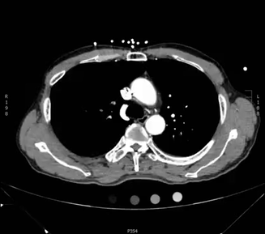

```{r setup, echo=FALSE, include=FALSE}
library(tidyverse)
```

```{r, xaringan themer, include=FALSE, warning=FALSE}
library(xaringanthemer)
style_duo_accent(primary_color = "#091F40", secondary_color = "#AC1E2D")
```

```{r, references, include=FALSE, cache=FALSE}
library(RefManageR)
BibOptions(
	check.entries = FALSE,
	style = "markdown",
	bib.style = "authoryear",
	max.names = 3,
	hyperlink = FALSE
)
bib <- ReadBib("../reference/Cardiology.bib", check = FALSE)
```

.pull-left[
## Purpose

- Create standardized approach to management of PE between all services, both surgical and medical

- Improve speed/efficiency in managing common diagnosis, both the lower and higher risk entities

- Simplify decision making in PE diagnosis and treatment
]

.pull-right[
## Objectives

1. Understand the overall purpose of a PERT at the JBVA

1. Appreciate the basic strategies involved in diagnosis and management of PE in combination with PERT

1. Know how to activate or consult the PERT at the JBVA 
]

_Pulmonary Embolism Response Team (PERT) at the Jesse Brown VA (JBVA) is now operating as of 02/01/22. This will mirror the PERT that is being developed at UIH._

---


---


.pull-left[
The basis of the PERT activation is to risk-stratify individuals with PE and help to decide on management. 
]

.pull-right[
__Additional features__: 

- clot in transit
- high clot burden or clot location
- risk for hemodynamic compromise
- evaluation in context (e.g. of ESRD status or chronic PH status)
]

---
### Interventions

| Intervention | Description |
|:--- |:--- |
| PO anticoagulation | treatment of almost all PE if candidate for AC |
| IV anticoagulation | treatment in acute setting or while diagnosis is being pursued, or prior to procedural intervention |
| systemic thrombolytics | treatment in setting of massive PE with no known contraindications |
| catheter directed thrombolytics | treatment in setting of submassive PE with reduced risk of bleeding complications (compared to systemic lytics) but without known contraindications |
| percutaneous thrombectomy | treatment when clot may be amenable to aspiration or removal (safer in patients that cannot tolerate AC) |

---
class: middle, inverse
# Consult Structure

---


The consult order request can be found under __Inpatient Consults__ in CPRS.

---


Additionally, under __Medical Services__, there is another location for the consult as __Inpatient Pulmonary Embolism__

---


This should allow most providers, from all specialties both surgical and medical, to be able to locate and request a consult. 

This should be accompanied by a page as well (the number will be listed on the consult order as well).

---


Contains the major information needed to order the consult, particularly markers of cardiac strain and objective evidence of clot burden.

---

.pull-left[
# Thank you

_In particular thanks to the UIC/JBVA residents and fellows, the PERT fellows, attendings and research team, Dr. Zar and the UIC IM leadership, and the JBVA leadership._


]

.pull-right[

]

