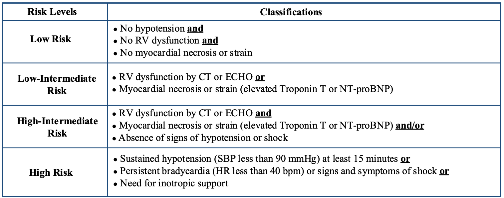
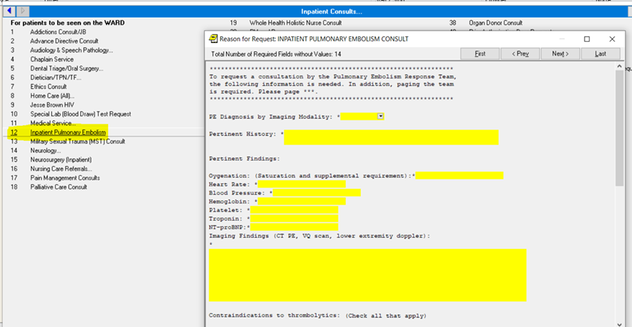
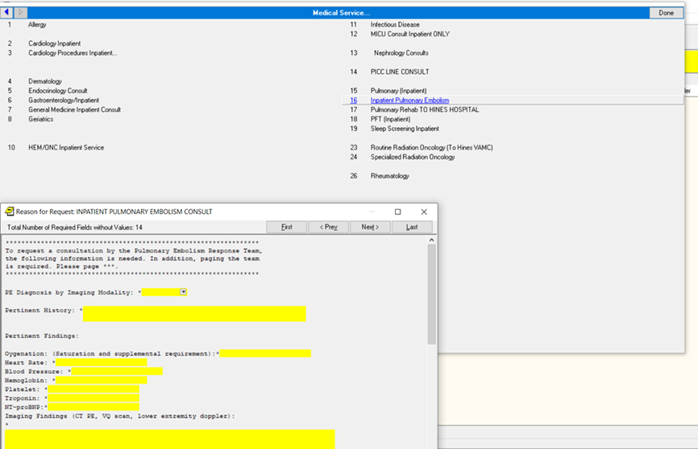
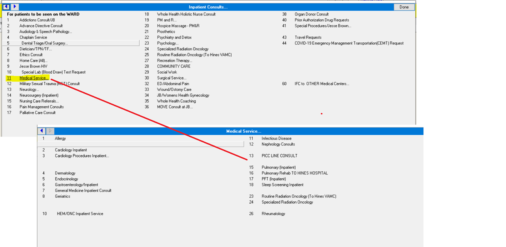
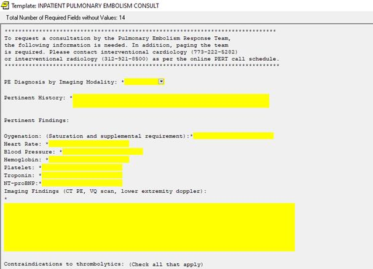
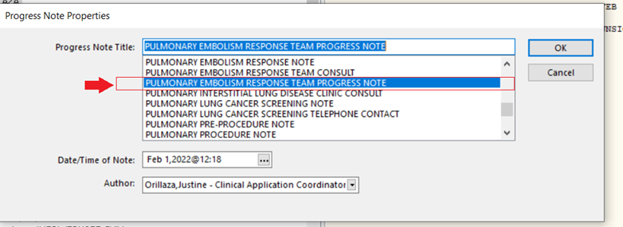
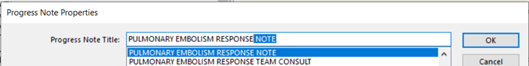
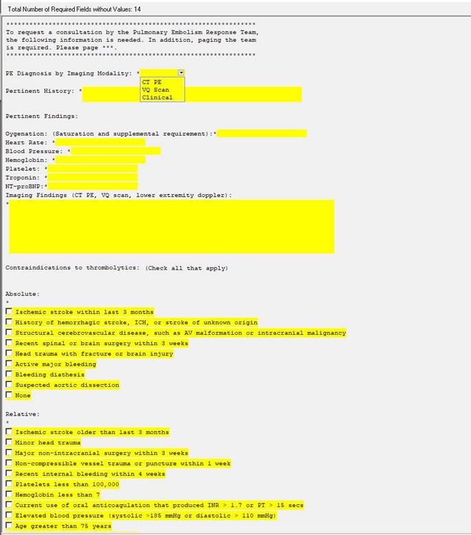
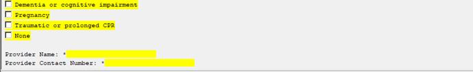
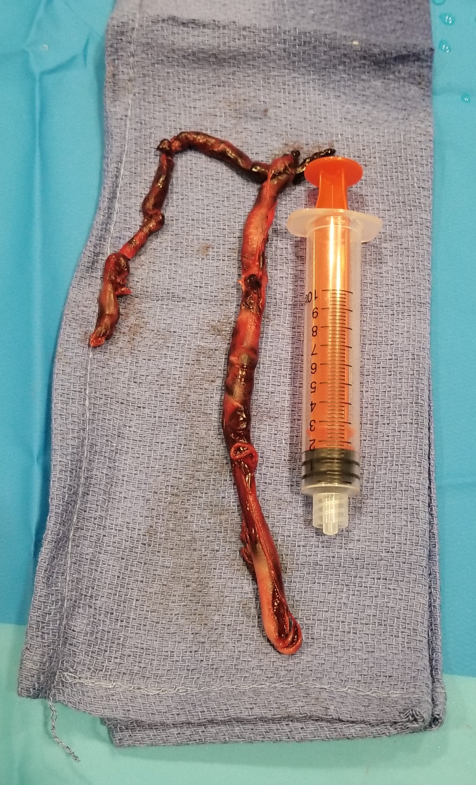

```{r setup, echo=FALSE, include=FALSE}
library(tidyverse)
```

```{r, xaringan themer, include=FALSE, warning=FALSE}
library(xaringanthemer)
style_duo_accent(primary_color = "#091F40", secondary_color = "#AC1E2D")
```

```{r, references, include=FALSE, cache=FALSE}
library(RefManageR)
BibOptions(
	check.entries = FALSE,
	style = "markdown",
	bib.style = "authoryear",
	max.names = 3,
	hyperlink = FALSE
)
bib <- ReadBib("../reference/Cardiology.bib", check = FALSE)
```

class: middle, inverse
# Introduction

---

### Objectives

1. Identify the overall purpose of a PERT at the JBVA

1. Understand the roles of stakeholder parties (residents, fellows, attendings in an interdisciplinary team)

1. Be aware of the call schedule and how to contact the appropriate PERT fellow

1. Know how the consult and consult responses are intended to be placed

1. Understand the basic strategies involved in PERT management

---
### Purpose

The Pulmonary Embolism Response Team (PERT) at the Jesse Brown VA (JBVA) has been initialized. Major purpose of PERT at JBVA is...

- Create standardized approach to management of PE between all services, both surgical and medical

- Improve speed/efficiency in managing common diagnosis, both the lower and higher risk entities

- Allow for QI and research into the management of submassive PE

- Help standardize response from different interventional services (IC and IR)

---
### Roles 

1. Residents = both surgical and medical residents to identify when to call for PERT consult

1. PERT Fellows = primary responsibility for responding to PERT activations (whether interventional or not) and triaging needs/resources required, both IR and cardiology

1. MICU = all patients will go to the MICU after intervention (thrombectomy/thrombolysis)

1. Cardiology Attendings = provide back-up support and decision making on acuity and need for intervention

---
### Call Schedules

- Will be switching between cardiology and interventional radiology on weekly basis

- Call scheduled to be published in advance (at least monthly)

- Pager will currently be rotated between services based on schedule (for cardiology, will be the JBVA consult pager)

- Call includes 24/7 coverage, including overnight

- Eventually will roll out a common pager that redirects appropriately

---
class: middle, inverse
# Approach

---


---
### Risk



The basis of the PERT activation is to risk-stratify individuals with PE and help to decide on management. Additional features: 

- clot in transit
- high clot burden or clot location
- risk for hemodynamic compromise
- evaluation in context (e.g. of ESRD status or chronic PH status)

---
### Interventions

| Intervention | Description |
|:--- |:--- |
| PO anticoagulation | treatment of almost all PE if candidate for AC |
| IV anticoagulation | treatment in acute setting or while diagnosis is being pursued, or prior to procedural intervention |
| systemic thrombolytics | treatment in setting of massive PE with no known contraindications |
| catheter directed thrombolytics | treatment in setting of submassive PE with reduced risk of bleeding complications (compared to systemic lytics) but without known contraindications |
| percutaneous thrombectomy | treatment when clot may be amenable to aspiration or removal (safer in patients that cannot tolerate AC) |

---
class: middle, inverse
# Consult Structure

---



The ordering team can find the consult in general __Inpatient Consults__

---



Can also be found under __Medical Services__

---



This should allow most providers, both medicine and surgery teams, to be able to locate this consult request.

---



Contains the major information needed to order the consult, particularly markers of cardiac strain and objective evidence of clot burden.

---



These are the locations of the associated notes to respond to PERT consult requests.



---

.pull-left[


]

.pull-right[
_Contents_

- PE diagnosis
- Narrative history
- Key objective findings (O2, HR, BP, coagulation labs, cardiac strain)
- Imaging findings (copy and paste or summary)
- Absolute/relative contraindications to TPA

This consult note is responded to at __time of consult request__ or as early as possible (particularly if intervention will be needed). 

]

---
class: middle, inverse
# Consult Orders

---

Procedure Order:

- Case request for pulmonary embolism thrombolysis/thrombectomy
- Diet: NPO
- Level of Care: ICU bed rest 

Labs prior to procedure:

- CMP, Full CBC with diff, PTT/PT/INR/anti-xa, Fibrinogen, D-Dimer, type and screen

Medications for procedure:

- Heparin and alteplase (in further detail subsequently)

---


Nursing orders post procedure:
- Vital signs: q15 minutes x 4, then q30 minutes x 4 then q1 hour
- Q4 hour neurologic checks
- Monitor closely for bleeding/hematoma at puncture site. Alert MD if any signs of bleeding. 
- Alert MICU service and service that performed the procedure (cardiology or IR) if blood pressure is >175 mmHg systolic or 110 mmHg diastolic 
- Alert MD if patient has any acute mental status changes
- No blood draws using phlebotomy and no arterial sticks
- Ensure the “DO NOT USE” stickers are on catheters that are infusing tPA
- Blood draws from either PICC or sheath
- Strict bed rest, HOB at 30 degrees after 6 hours
- No placement of central venous line/IM injections/Arterial Line/NG Tube/Foley while receiving thromboytics
- Avoid placing peripheral IV lines while receiving thrombolytics if possible

Diet post procedure:
- Clear liquid diet

---

### Alteplase

- Dose: 0.48 mg/hr (32ml/hr) if two sites OR 0.96 mg/hr (64ml/hr) if one site
- Concentration: 7.5mg/500ml NS
- Administration: via sheath
- Monitoring: q4hours 
	- If fibrinogen is >150, continue tPA infusion at 0.48 mg/hour (32 mL/hour) into each sheath
	- If fibrinogen 100-150, reduce tPA infusion by 50% in each sheath and recheck in 2 hours
	- If below 100, hold tPA and infuse 0.9 NS at 40 mL/hour for 2 hours and recheck fibrinogen in 2 hours. Once fibrinogen is > 100, resume tPA at 25% of previous dose.
- Duration: 12 hours

---

### Heparin 

- Dose: 600 units/hr (if weight < 50kg, start at 400 units/hr)
- Concentration: 10,000 units/100ml (standard 100 units/ml)
- Administration: peripheral IV or side arm of sheath 
- Monitoring: anti-Xa q4 hours with goal anti-Xa ≤0.3
- If antiXa level is > 0.3, decrease the heparin rate by 50% then recheck anti-Xa levels in 3 hours
- Duration: 12 hours
- Once tPA infusion has been completed, initiate full anticoagulation 
- Avoid low molecular weight heparin or oral anticoagulants if a patient is undergoing or being considered for catheter directed TPA

---

In the event of bleeding:

- Discontinue tPA infusion immediately
- Discontinue heparin infusion immediately
- Reversal agents for tPA (in the setting large volume bleeding or intracranial hemorrhage
- Cryoprecipitate 10 unit IV, or tranexamic acid 10-15 mg/kg IV over 20 minutes (Frontera et al. Crit Care Med 2016; 44:2251-2257)

Post procedure monitoring:

- If there are any acute changes in mental status or neurologic exams, discontinue both drips and send for STAT non-contrast CT head
- Service that placed catheter will remove both sheath and catheter unless needed for other use.  

---
class: middle, inverse

.pull-left[
# Thank you

Particular thanks to...

- Dr. Ardati
- Dr. Gupta
- Dr. Unterman
- Dr. Goodwin
- JBVA/UIC residents and fellows
- PERT Research Team
]

.pull-right[

]

