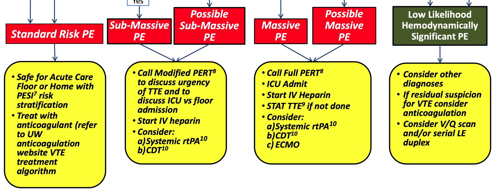
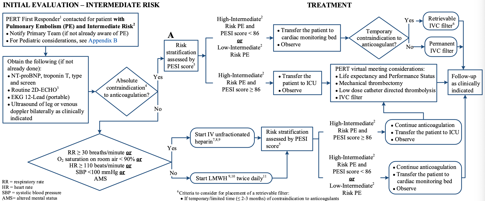
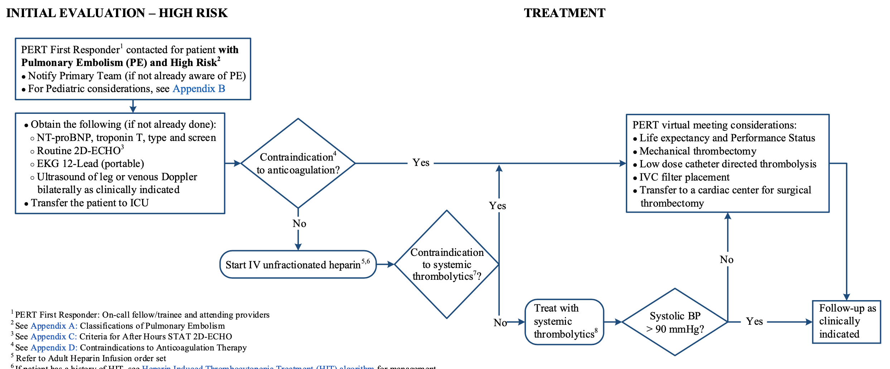
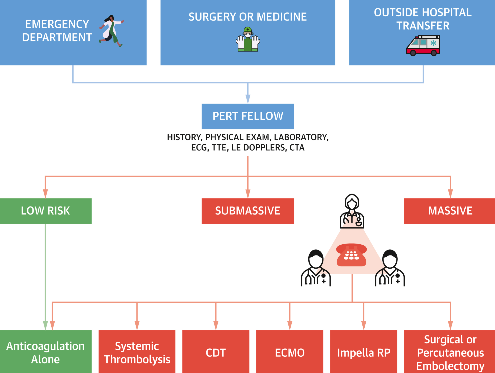

```{r setup, echo=FALSE, include=FALSE}
library(tidyverse)
```

```{r, xaringan themer, include=FALSE, warning=FALSE}
library(xaringanthemer)
style_duo_accent(primary_color = "#091F40", secondary_color = "#AC1E2D")
```

```{r, references, include=FALSE, cache=FALSE}
library(RefManageR)
BibOptions(
	check.entries = FALSE,
	style = "markdown",
	bib.style = "authoryear",
	max.names = 3,
	hyperlink = FALSE
)
bib <- ReadBib("Cardiology.bib", check = FALSE)
```

class: middle, inverse
# Introduction

---

.pull-left[
### Objectives

1. Identify the gap in management of pulmonary embolisms at UIC
1. Propose plan to bridge gap with a pulmonary embolism response team
]

.pull-right[
### Outline
1. Risk stratification quandaries and variation in practice patterns
1. Role of cardiology in management, from diagnostic to intervention
1. Potential algorithms for incorporation at UIC and JBVA
1. Purpose of fellows both at UIC and JBVA as part of response team
1. Benefits of incorporation to fellows and system practice
]

---

### Importance

.pull-left[
- third most common cause of cardiovascular death in USA
- treatment is guided by severity, but risk stratification is not universally accepted
- multimodal in diagnostics and intervention, with multiple specialties that may diagnose/manage
]

.pull-right[
Guidelines are not in agreement from major societies:

- American Heart Association
- American College of Chest Physicians
- European Society of Cardiology
]

Primary Services: EM, IM  
Surgery Services: OB-GYN, General, Neurosurgery  
Managing Services: MICU, **Cardiology**, Pulmonology  
Interventional/Diagnostic Services: (Interventional) Radiology, **Cardiology**

---

### Diagnostic Involvement

.pull-left[ 
CXR  
Cardiac Enzymes
CT PE  
Echocardiogram  
Pulmonary Angiography  
]

.pull-right[
Radiology  
Interventional Radiology  
**Cardiology**  
**Interventional Cardiology**  
]

### Management Involvement

| Severity | Team | Intervention |
| --- | --- | --- |
| Subsegmental/segmental | IM, EM | oral anticoagulation |
| Submassive | **Cards**, IR | thrombectomy, catheter-directed lytics
| Massive | EM, **Cards** | systemic thrombolytics | 

* May also benefit from Hematology in complex anticoagulation scenarios

---

class: middle, inverse
# PE Response Team

---

### Concepts

- Similar to *Heart Team* concept for multidisciplinary collaboration for complex medical situations

- Helpful in situations with intermediate and high-risk patients with PEs (as it allows mobilization of resources)

- Serves as a rapid-response system, in which any clinician can "activate" the PERT

---

### Classification


---

### Severity



---

### Intermediate Risk



---

### High Risk



---

class: middle, inverse
# UIC and JBVA Teams

---

### PERT Members

| Speciality | Role |
| --- | --- | 
| Cardiology | Primary contact for team activation, including echocardiography, and potential interventions (e.g. thrombectomy, lytics) |
| Radiology | Diagnostic role via CT PE, and potential back-up for intervention |
| Critical Care | Patient may require continuous critical monitoring for cardiopulmonary dysfunction |
| Hematology | Assistance in complex anticoagulation situations |
| CT Surgery | Not applicable at UIC/JBVA |

---

### PERT Activation

1. All PEs, suspected or diagnosed, should refer to the PE algorithm generated for both UIC and JBVA. 

1. PE should be documented (potential PE template in CPRS and EPIC)

1. PERT should be activated if indicated by algorithm

1. PERT would be fielded by the on-call cardiology fellow, with interventional attending as back-up

1. Based on severity and need, would be escalated to additional team-members

1. This may end up in a decision for lab-activation for intervention, or decision for TPA

---



---

### Fellow's Role

- Primary call responsibility for PE

- Decision to be made on whether it is low-risk (versus intermediate/high risk)

- If of greater risk, can review primary data (e.g. CT PE, surface echocardiogram, ECG) and can discuss with on-call attending

- Scrub into and assist with case, potentially in partnership with IR as well

- Present cases during monthly PE conferences (multidisciplinary, likely IM/EM joint conference)

- Potential research opportunities, including PERT consortium and registries

---

class: middle, inverse
# Conclusion

---

### Final Thoughts

- create an algorithm inline with PERT consortium guidelines

- simplify/streamline the management of PE at UIC and JBVA

- additional opportunity for fellow education

- research opportunity and QI at university level

- bridging a gap in patient care (limiting the variability in PE management)
